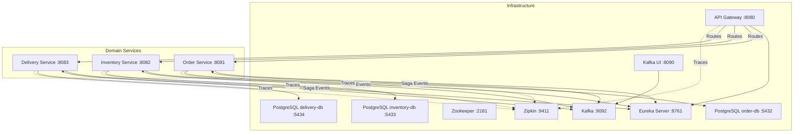
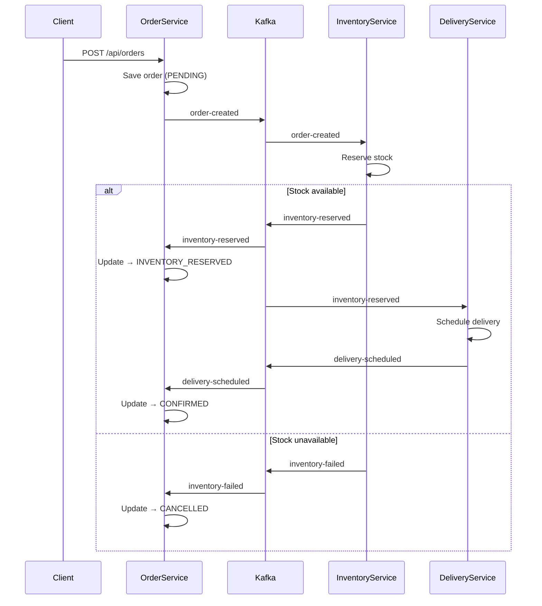

# Spring Cloud Reactive Microservices

    

A fully reactive Spring Cloud microservices demo implementing the **choreography-based Saga pattern** with Kafka, WebFlux, R2DBC, and distributed tracing.

---

## Architecture Overview



### Services

| Module | Port | Description |
|--------|------|-------------|
| `discovery-server` | 8761 | Eureka service registry |
| `api-gateway` | 8080 | Spring Cloud Gateway with Resilience4j circuit breakers |
| `order-service` | 8081 | Order lifecycle management |
| `inventory-service` | 8082 | Stock management; pre-seeded: prod-1:100, prod-2:50, prod-3:200 |
| `delivery-service` | 8083 | Delivery scheduling |

---

## Saga Flow



### Status Transitions

| Event | Order Status |
|-------|-------------|
| Order created | `PENDING` |
| `inventory-reserved` received | `INVENTORY_RESERVED` |
| `delivery-scheduled` received | `CONFIRMED` |
| `inventory-failed` received | `CANCELLED` |

---

## Project Structure

```
spring-cloud2/
├── pom.xml                          # Parent POM (multi-module)
├── docker-compose.yml               # Full stack (all services + infrastructure)
├── docker-compose-debug.yml         # Debug stack with JDWP ports
├── discovery-server/                # Eureka Server
├── api-gateway/                     # Spring Cloud Gateway
│   ├── config/GatewayConfig         # Routes + circuit breaker filters
│   └── controller/FallbackController # Fallback responses
├── order-service/                   # Order lifecycle
│   ├── model/Order                  # Entity (PENDING/INVENTORY_RESERVED/CONFIRMED/CANCELLED)
│   ├── event/SagaEventConsumer      # Listens: inventory-reserved, inventory-failed, delivery-scheduled
│   └── config/KafkaConfig, DatabaseConfig
├── inventory-service/               # Stock management
│   ├── event/SagaEventConsumer      # Listens: order-created → reserves stock
│   ├── event/SagaEventProducer      # Publishes: inventory-reserved / inventory-failed
│   └── config/KafkaConfig, DatabaseConfig
└── delivery-service/                # Delivery scheduling
    ├── event/SagaEventConsumer      # Listens: inventory-reserved → schedules delivery
    ├── event/SagaEventProducer      # Publishes: delivery-scheduled
    └── config/KafkaConfig, DatabaseConfig
```

---

## Technology Stack

| Technology | Version | Purpose |
|------------|---------|---------|
| Java | 21 | Language runtime |
| Spring Boot | 3.5.0 | Application framework |
| Spring Cloud | 2025.0.0 | Cloud-native infrastructure |
| Spring WebFlux | — | Reactive HTTP layer (`Mono`/`Flux`) |
| Spring Data R2DBC | — | Reactive PostgreSQL access |
| PostgreSQL | 16 | Persistent storage (one DB per service) |
| Apache Kafka | — | Saga event bus (choreography) |
| Resilience4j | — | Circuit breakers on gateway routes |
| Micrometer + OpenTelemetry | — | Metrics and distributed tracing |
| Zipkin | — | Trace visualization |
| Testcontainers | — | Integration testing with real containers |
| Docker Compose | — | Local stack orchestration |

---

## Prerequisites

- JDK 21
- Maven 3.9+
- Docker + Docker Compose

---

## Build & Run

```bash
# Build all modules (skip tests)
mvn clean package -DskipTests

# Build a single module
mvn clean package -DskipTests -pl order-service

# Start full stack (builds images and starts all containers)
docker compose up --build

# Start in background
docker compose up -d --build

# Start without rebuilding images
docker compose up

# Debug mode (with JDWP remote debug ports)
docker compose -f docker-compose-debug.yml up --build

# Tear down
docker compose down
```

---

## Service Access Points

| Service | URL | Description |
|---------|-----|-------------|
| API Gateway | http://localhost:8080 | All business traffic goes here |
| Eureka Dashboard | http://localhost:8761 | Service registry UI |
| Kafka UI | http://localhost:8090 | Browse topics and messages |
| Zipkin Traces | http://localhost:9411 | Distributed trace visualization |
| Order Service (direct) | http://localhost:8081 | Bypass gateway |
| Inventory Service (direct) | http://localhost:8082 | Bypass gateway |
| Delivery Service (direct) | http://localhost:8083 | Bypass gateway |

> **Note:** All business endpoints should be accessed via the gateway at port 8080.

---

## REST API Reference

### Order Service — `/api/orders`

| Method | Path | Description | Request Body |
|--------|------|-------------|-------------|
| `POST` | `/api/orders` | Create a new order | `{"productId":"prod-1","quantity":2,"price":29.99}` |
| `GET` | `/api/orders/{id}` | Get order by ID | — |
| `GET` | `/api/orders` | List all orders | — |

**Example response:**
```json
{
  "id": 1,
  "productId": "prod-1",
  "quantity": 2,
  "price": 29.99,
  "status": "CONFIRMED",
  "failureReason": null,
  "createdAt": "2025-01-01T10:00:00",
  "updatedAt": "2025-01-01T10:00:05"
}
```

### Inventory Service — `/api/inventory`

| Method | Path | Description | Request Body |
|--------|------|-------------|-------------|
| `GET` | `/api/inventory` | List all inventory items | — |
| `GET` | `/api/inventory/{productId}` | Get item by product ID | — |
| `POST` | `/api/inventory` | Add/update inventory item | `{"productId":"prod-4","quantity":50,"reservedQuantity":0}` |

**Example response:**
```json
{
  "id": 1,
  "productId": "prod-1",
  "quantity": 98,
  "reservedQuantity": 2
}
```

### Delivery Service — `/api/deliveries`

| Method | Path | Description |
|--------|------|-------------|
| `GET` | `/api/deliveries` | List all deliveries |
| `GET` | `/api/deliveries/{id}` | Get delivery by ID |
| `GET` | `/api/deliveries/order/{orderId}` | Get delivery for an order |

**Example response:**
```json
{
  "id": 1,
  "orderId": 1,
  "productId": "prod-1",
  "quantity": 2,
  "status": "SCHEDULED",
  "address": "123 Auto-generated St",
  "scheduledAt": "2025-01-01T10:00:05",
  "deliveredAt": null
}
```

---

## Testing the Saga

The inventory service is **pre-seeded** with: `prod-1: 100`, `prod-2: 50`, `prod-3: 200`.

### Happy Path (sufficient stock)

```bash
# 1. Create an order via the API Gateway
curl -X POST http://localhost:8080/api/orders \
  -H "Content-Type: application/json" \
  -d '{"productId":"prod-1","quantity":2,"price":29.99}'
# Response: {"id":1,"status":"PENDING",...}

# 2. Wait a moment for the Saga to complete, then check order status
curl http://localhost:8080/api/orders/1
# Status should progress: PENDING → INVENTORY_RESERVED → CONFIRMED

# 3. Check that a delivery was scheduled
curl http://localhost:8080/api/deliveries/order/1
# Response: {"id":1,"orderId":1,"status":"SCHEDULED",...}

# 4. Check updated inventory (quantity reduced by 2)
curl http://localhost:8080/api/inventory/prod-1
```

### Failure Path (insufficient stock)

```bash
# Request more than available stock
curl -X POST http://localhost:8080/api/orders \
  -H "Content-Type: application/json" \
  -d '{"productId":"prod-2","quantity":999,"price":9.99}'

# Check order — should be CANCELLED with a failure reason
curl http://localhost:8080/api/orders/2
# Response: {"status":"CANCELLED","failureReason":"Insufficient stock",...}
```

### View Traces

Open Zipkin at http://localhost:9411 to see the full distributed trace across all services.

---

## Running Tests

Integration tests use Testcontainers — Docker must be running.

```bash
# Run all tests (all modules)
mvn test

# Run integration tests for a single service (requires Docker for Testcontainers)
mvn test -pl order-service

# Run gateway unit tests only (no Docker needed)
mvn test -pl api-gateway
```

Each business service has one integration test (`OrderServiceIntegrationTest`, etc.) using:
- `@SpringBootTest` + `@Testcontainers` + `@ActiveProfiles("test")`
- `@ServiceConnection` for automatic container wiring (Postgres, Kafka)
- Test profile disables Eureka and Zipkin

---

## Remote Debugging

Use the debug Compose file to expose JDWP ports for each service:

```bash
docker compose -f docker-compose-debug.yml up --build
```

| Service | Debug Port |
|---------|------------|
| discovery-server | 5005 |
| api-gateway | 5006 |
| order-service | 5007 |
| inventory-service | 5008 |
| delivery-service | 5009 |

Connect your IDE to `localhost:<port>` with remote JVM debug configuration.

---

## Database Schemas

### Order Service (`orderdb`)

```sql
CREATE TABLE orders (
    id             BIGSERIAL PRIMARY KEY,
    product_id     VARCHAR(255) NOT NULL,
    quantity       INTEGER NOT NULL,
    price          DECIMAL(10, 2),
    status         VARCHAR(50) NOT NULL DEFAULT 'PENDING',
    failure_reason VARCHAR(500),
    created_at     TIMESTAMP DEFAULT CURRENT_TIMESTAMP,
    updated_at     TIMESTAMP DEFAULT CURRENT_TIMESTAMP
);
```

### Inventory Service (`inventorydb`)

```sql
CREATE TABLE inventory_items (
    id                BIGSERIAL PRIMARY KEY,
    product_id        VARCHAR(255) NOT NULL UNIQUE,
    quantity          INTEGER NOT NULL DEFAULT 0,
    reserved_quantity INTEGER NOT NULL DEFAULT 0
);
-- Pre-seeded: prod-1:100, prod-2:50, prod-3:200
```

### Delivery Service (`deliverydb`)

```sql
CREATE TABLE deliveries (
    id           BIGSERIAL PRIMARY KEY,
    order_id     BIGINT NOT NULL,
    product_id   VARCHAR(255) NOT NULL,
    quantity     INTEGER NOT NULL,
    status       VARCHAR(50) NOT NULL DEFAULT 'SCHEDULED',
    address      VARCHAR(500),
    scheduled_at TIMESTAMP DEFAULT CURRENT_TIMESTAMP,
    delivered_at TIMESTAMP
);
```

---

## Kafka Topics

| Topic | Producer | Consumer |
|-------|----------|---------|
| `order-created` | order-service | inventory-service |
| `inventory-reserved` | inventory-service | order-service, delivery-service |
| `inventory-failed` | inventory-service | order-service |
| `delivery-scheduled` | delivery-service | order-service |

---

## Resilience4j Circuit Breakers

All API Gateway routes have circuit breaker filters configured:

| Parameter | Value |
|-----------|-------|
| Sliding window size | 10 requests |
| Failure rate threshold | 50% |
| Open state wait duration | 10 seconds |
| Fallback | Returns 503 with a message from `FallbackController` |

---

## Distributed Tracing

All services export traces to Zipkin at 100% sampling rate using Micrometer + OpenTelemetry bridge. View traces at http://localhost:9411.

Tracing is disabled in test profiles (`management.tracing.enabled: false`).
