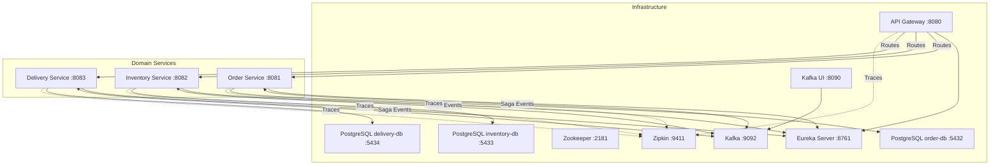
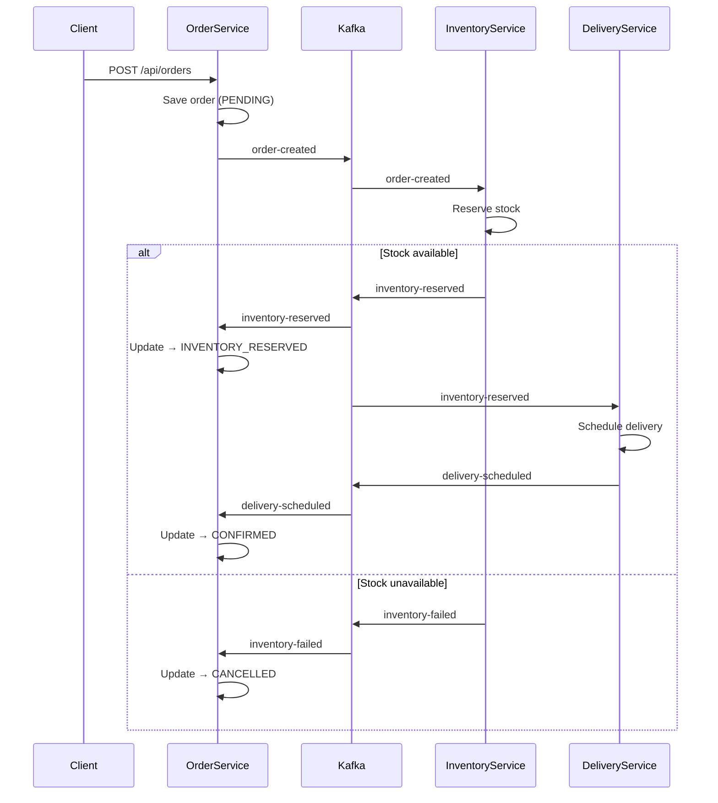

# Spring Cloud Reactive Microservices with Saga Pattern

A fully implemented multi-module Maven project with **Spring Boot 3.5.0**, **Spring Cloud 2025.0.0**, **Java 21**, fully reactive (WebFlux + R2DBC), using the choreography-based Saga pattern with Kafka.

## Architecture Overview



### Saga Flow (Choreography)



---

## Implementation Summary

### 6 Modules

| Module | Type | Port | Key Responsibility |
|--------|------|------|-------------------|
| **Parent POM** | Parent | — | Dependency management (Spring Boot 3.5.0, Spring Cloud 2025.0.0, Java 21) |
| **discovery-server** | Service | 8761 | Eureka Server for service registration/discovery |
| **api-gateway** | Service | 8080 | Spring Cloud Gateway with Resilience4j circuit breakers |
| **order-service** | Service | 8081 | Order lifecycle (PENDING → INVENTORY_RESERVED → CONFIRMED/CANCELLED) |
| **inventory-service** | Service | 8082 | Stock management; pre-seeded: prod-1:100, prod-2:50, prod-3:200 |
| **delivery-service** | Service | 8083 | Delivery scheduling |

---

### Discovery Server (`discovery-server/`)

#### Files

| File | Purpose |
|------|---------|
| `pom.xml` | Dependencies: `spring-cloud-starter-netflix-eureka-server` |
| `src/main/java/reacty/probe/one/inventory/discovery/DiscoveryServerApplication.java` | Main class with `@EnableEurekaServer` |
| `src/main/resources/application.yml` | Port 8761, self-registration disabled |
| `Dockerfile` | Multi-stage Maven build with Eclipse Temurin 21 |

---

### API Gateway (`api-gateway/`)

#### Files

| File | Purpose |
|------|---------|
| `pom.xml` | Dependencies: `spring-cloud-starter-gateway`, `eureka-client`, `resilience4j`, `micrometer-tracing` |
| `src/main/java/reacty/probe/one/inventory/gateway/ApiGatewayApplication.java` | Main class |
| `src/main/java/reacty/probe/one/inventory/gateway/config/GatewayConfig.java` | Routes (`lb://order-service`, `lb://inventory-service`, `lb://delivery-service`) with circuit breaker filters |
| `src/main/java/reacty/probe/one/inventory/gateway/controller/FallbackController.java` | Fallback responses when circuit breaker opens |
| `src/main/resources/application.yml` | Gateway route config, Zipkin endpoint |
| `Dockerfile` | Multi-stage Maven build |

---

### Order Service (`order-service/`)

#### Files

| File | Purpose |
|------|---------|
| `pom.xml` | Dependencies: `spring-boot-starter-webflux`, `spring-boot-starter-data-r2dbc`, `r2dbc-postgresql`, `spring-kafka`, `eureka-client`, `resilience4j`, `micrometer-tracing-bridge-otel` |
| `src/main/java/reacty/probe/one/inventory/order/OrderServiceApplication.java` | Main class |
| `src/main/java/reacty/probe/one/inventory/order/model/Order.java` | JPA entity: id, productId, quantity, price, status (PENDING/INVENTORY_RESERVED/CONFIRMED/CANCELLED), failureReason, timestamps |
| `src/main/java/reacty/probe/one/inventory/order/repository/OrderRepository.java` | `ReactiveCrudRepository<Order, Long>` |
| `src/main/java/reacty/probe/one/inventory/order/service/OrderService.java` | Business logic: create order, update status, publish `OrderCreatedEvent` |
| `src/main/java/reacty/probe/one/inventory/order/controller/OrderController.java` | REST endpoints (WebFlux): POST `/api/orders`, GET `/api/orders/{id}`, GET `/api/orders` |
| `src/main/java/reacty/probe/one/inventory/order/event/OrderCreatedEvent.java` | Record: orderId, productId, quantity |
| `src/main/java/reacty/probe/one/inventory/order/event/SagaEventConsumer.java` | Listens: `inventory-reserved`, `inventory-failed`, `delivery-scheduled` → updates order status |
| `src/main/java/reacty/probe/one/inventory/order/config/KafkaConfig.java` | Kafka producer/consumer beans |
| `src/main/java/reacty/probe/one/inventory/order/config/DatabaseConfig.java` | R2DBC connection pool and DDL initialization |
| `src/main/resources/application.yml` | Server config: port 8081, R2DBC, Kafka, Eureka, Zipkin |
| `src/main/resources/schema.sql` | Table: `orders` (BIGSERIAL id, VARCHAR product_id, INTEGER quantity, DECIMAL price, VARCHAR status, VARCHAR failure_reason, TIMESTAMP created_at/updated_at) |
| `src/test/resources/application-test.yml` | Test profile: disables Eureka, Zipkin; uses embedded Postgres via `@ServiceConnection` |
| `Dockerfile` | Multi-stage Maven build |

---

### Inventory Service (`inventory-service/`)

#### Files

| File | Purpose |
|------|---------|
| `pom.xml` | Dependencies: same as order-service |
| `src/main/java/reacty/probe/one/inventory/inventory/InventoryServiceApplication.java` | Main class |
| `src/main/java/reacty/probe/one/inventory/inventory/model/InventoryItem.java` | JPA entity: id, productId (UNIQUE), quantity, reservedQuantity |
| `src/main/java/reacty/probe/one/inventory/inventory/repository/InventoryRepository.java` | `ReactiveCrudRepository` + custom query: `findByProductId(String productId)` |
| `src/main/java/reacty/probe/one/inventory/inventory/service/InventoryService.java` | Business logic: reserve/release stock |
| `src/main/java/reacty/probe/one/inventory/inventory/controller/InventoryController.java` | REST endpoints: GET `/api/inventory`, GET `/api/inventory/{productId}`, POST `/api/inventory` |
| `src/main/java/reacty/probe/one/inventory/inventory/event/SagaEventConsumer.java` | Listens: `order-created` → reserves stock → publishes `InventoryReservedEvent` or `InventoryFailedEvent` |
| `src/main/java/reacty/probe/one/inventory/inventory/event/SagaEventProducer.java` | Publishes: `InventoryReservedEvent`, `InventoryFailedEvent` |
| `src/main/java/reacty/probe/one/inventory/inventory/config/KafkaConfig.java` | Kafka configuration |
| `src/main/java/reacty/probe/one/inventory/inventory/config/DatabaseConfig.java` | R2DBC config |
| `src/main/resources/application.yml` | Server config: port 8082 |
| `src/main/resources/schema.sql` | Table: `inventory_items` + seed data (prod-1:100, prod-2:50, prod-3:200) |
| `Dockerfile` | Multi-stage Maven build |

---

### Delivery Service (`delivery-service/`)

#### Files

| File | Purpose |
|------|---------|
| `pom.xml` | Dependencies: same as order-service |
| `src/main/java/reacty/probe/one/inventory/delivery/DeliveryServiceApplication.java` | Main class |
| `src/main/java/reacty/probe/one/inventory/delivery/model/Delivery.java` | JPA entity: id, orderId, productId, quantity, status (SCHEDULED), address, scheduledAt, deliveredAt |
| `src/main/java/reacty/probe/one/inventory/delivery/repository/DeliveryRepository.java` | `ReactiveCrudRepository` + custom: `findByOrderId(Long orderId)` |
| `src/main/java/reacty/probe/one/inventory/delivery/service/DeliveryService.java` | Business logic: schedule delivery |
| `src/main/java/reacty/probe/one/inventory/delivery/controller/DeliveryController.java` | REST endpoints: GET `/api/deliveries`, GET `/api/deliveries/{id}`, GET `/api/deliveries/order/{orderId}` |
| `src/main/java/reacty/probe/one/inventory/delivery/event/SagaEventConsumer.java` | Listens: `inventory-reserved` → schedules delivery → publishes `DeliveryScheduledEvent` |
| `src/main/java/reacty/probe/one/inventory/delivery/event/SagaEventProducer.java` | Publishes: `DeliveryScheduledEvent` |
| `src/main/java/reacty/probe/one/inventory/delivery/config/KafkaConfig.java` | Kafka configuration |
| `src/main/java/reacty/probe/one/inventory/delivery/config/DatabaseConfig.java` | R2DBC config |
| `src/main/resources/application.yml` | Server config: port 8083 |
| `src/main/resources/schema.sql` | Table: `deliveries` (BIGSERIAL id, BIGINT order_id, VARCHAR product_id, INTEGER quantity, VARCHAR status, VARCHAR address, TIMESTAMP scheduled_at/delivered_at) |
| `Dockerfile` | Multi-stage Maven build |

---

### Docker Compose

#### [docker-compose.yml](docker-compose.yml)

Infrastructure:
| Container | Image | Ports | Notes |
|-----------|-------|-------|-------|
| `zookeeper` | `confluentinc/cp-zookeeper:7.6.0` | 2181 | Kafka coordination |
| `kafka` | `confluentinc/cp-kafka:7.6.0` | 9092 | Event bus (auto-create topics) |
| `kafka-ui` | `provectuslabs/kafka-ui:v0.7.2` | 8090 | Kafka UI for topic/message inspection |
| `zipkin` | `openzipkin/zipkin:latest` | 9411 | Trace visualization |
| `postgres-order` | `postgres:16-alpine` | 5432 | Order DB |
| `postgres-inventory` | `postgres:16-alpine` | 5433 | Inventory DB |
| `postgres-delivery` | `postgres:16-alpine` | 5434 | Delivery DB |

Services (all with `build: context ./module-name`):
| Service | Port | Health Check | Dependencies |
|---------|------|--------------|--------------|
| `discovery-server` | 8761 | `/actuator/health` | Kafka, all DBs, Zipkin |
| `api-gateway` | 8080 | — | discovery-server |
| `order-service` | 8081 | — | discovery-server, Kafka, postgres-order |
| `inventory-service` | 8082 | — | discovery-server, Kafka, postgres-inventory |
| `delivery-service` | 8083 | — | discovery-server, Kafka, postgres-delivery |

#### [docker-compose-debug.yml](docker-compose-debug.yml)

Same as above with additional JDWP (Java Debug Wire Protocol) port mappings:

| Service | Debug Port |
|---------|------------|
| discovery-server | 5005 |
| api-gateway | 5006 |
| order-service | 5007 |
| inventory-service | 5008 |
| delivery-service | 5009 |

---

## Cross-Cutting Concerns

| Concern | Implementation |
|---------|----------------|
| **Service Discovery** | Eureka Server (`discovery-server`) + `@EnableDiscoveryClient` on all services |
| **Load Balancing** | Spring Cloud LoadBalancer via `lb://service-name` URIs in Gateway routes |
| **Circuit Breakers** | Resilience4j on all gateway routes (sliding window: 10, failure threshold: 50%, open wait: 10s) |
| **Fallback** | `FallbackController` returns 503 Service Unavailable |
| **Distributed Tracing** | Micrometer Tracing + OpenTelemetry bridge → Zipkin (100% sampling) |
| **API Gateway** | Spring Cloud Gateway (reactive) with route predicates & filters |
| **Reactive Stack** | WebFlux controllers, R2DBC repositories, Project Reactor `Mono`/`Flux` throughout |
| **Saga Pattern** | Choreography via Kafka topics: `order-created`, `inventory-reserved`, `inventory-failed`, `delivery-scheduled` |
| **Event Serialization** | Jackson JSON; Kafka config: `JsonDeserializer.USE_TYPE_INFO_HEADERS: false`, `TRUSTED_PACKAGES: "reacty.probe.one.inventory.*"` |
| **Database** | PostgreSQL (one instance per service on different ports); R2DBC for reactive access; schema initialization via `schema.sql` |

## Testing

Integration tests use **Testcontainers** with `@SpringBootTest`, `@Testcontainers`, `@ActiveProfiles("test")`, and `@ServiceConnection` for automatic container wiring (PostgreSQL, Kafka).

Each business service has one integration test (e.g., `OrderServiceIntegrationTest`).
API Gateway has unit tests using `@WebFluxTest` (no Docker needed).

Test profile (`application-test.yml`) disables Eureka and Zipkin.

```bash
# Run all tests
mvn test

# Integration tests for a single service (requires Docker)
mvn test -pl order-service

# Gateway unit tests only (no Docker)
mvn test -pl api-gateway
```

## Verification Results

All modules compile successfully:

```
Microservices Parent ............ SUCCESS
Discovery Server ............... SUCCESS
API Gateway .................... SUCCESS
Order Service .................. SUCCESS
Inventory Service .............. SUCCESS
Delivery Service ............... SUCCESS
```

Manual verification via `docker compose up --build`:
1. Eureka dashboard: http://localhost:8761 — all services registered
2. Create order: `curl -X POST http://localhost:8080/api/orders -H "Content-Type: application/json" -d '{"productId":"prod-1","quantity":2,"price":29.99}'`
3. Order status transitions: PENDING → INVENTORY_RESERVED → CONFIRMED (or CANCELLED if insufficient stock)
4. Delivery is auto-scheduled
5. View traces: http://localhost:9411
6. Inspect Kafka topics: http://localhost:8090
