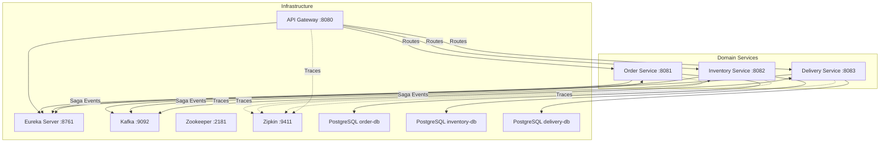
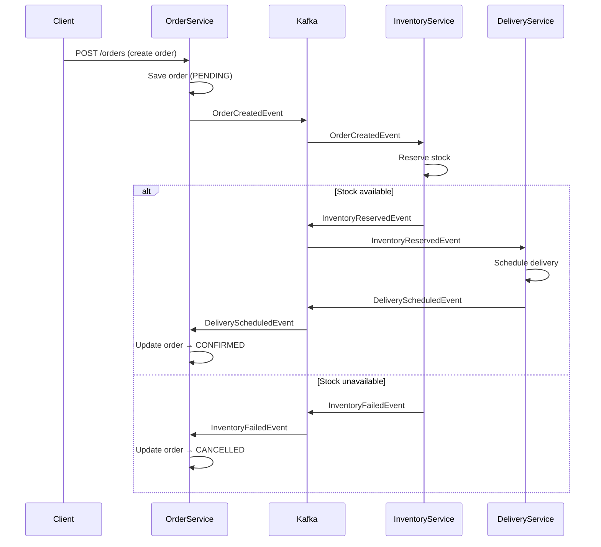

# Spring Cloud Reactive Microservices with Saga Pattern

Build a multi-module Maven project with **Spring Boot 3.5+**, **Spring Cloud 2025.0+**, **Java 21**, fully reactive (WebFlux + R2DBC), using the choreography-based Saga pattern with Kafka.

## Architecture Overview

### Saga Flow (Choreography)

## Proposed Changes

### Project Root

#### [NEW] [pom.xml](file:///home/eug/.gemini/antigravity/playground/outer-flare/pom.xml)
Multi-module parent POM:
- `spring-boot-starter-parent` 3.5.0
- `spring-cloud.version` = `2025.0.0`
- Java 21
- Modules: `discovery-server`, `api-gateway`, `order-service`, `inventory-service`, `delivery-service`

#### [NEW] [.gitignore](file:///home/eug/.gemini/antigravity/playground/outer-flare/.gitignore)
Standard Java/Maven gitignore

---

### Discovery Server (`discovery-server/`)

#### [NEW] [pom.xml](file:///home/eug/.gemini/antigravity/playground/outer-flare/discovery-server/pom.xml)
Dependencies: `spring-cloud-starter-netflix-eureka-server`

#### [NEW] [DiscoveryServerApplication.java](file:///home/eug/.gemini/antigravity/playground/outer-flare/discovery-server/src/main/java/com/example/discovery/DiscoveryServerApplication.java)
`@EnableEurekaServer` + `@SpringBootApplication`

#### [NEW] [application.yml](file:///home/eug/.gemini/antigravity/playground/outer-flare/discovery-server/src/main/resources/application.yml)
Port 8761, self-registration disabled

---

### API Gateway (`api-gateway/`)

#### [NEW] [pom.xml](file:///home/eug/.gemini/antigravity/playground/outer-flare/api-gateway/pom.xml)
Dependencies: `spring-cloud-starter-gateway` (reactive), `eureka-client`, `resilience4j`, `micrometer-tracing`

#### [NEW] [ApiGatewayApplication.java](file:///home/eug/.gemini/antigravity/playground/outer-flare/api-gateway/src/main/java/com/example/gateway/ApiGatewayApplication.java)

#### [NEW] [application.yml](file:///home/eug/.gemini/antigravity/playground/outer-flare/api-gateway/src/main/resources/application.yml)
- Routes → `order-service`, `inventory-service`, `delivery-service` via `lb://`
- Circuit breaker filters per route
- Zipkin tracing endpoint

---

### Order Service (`order-service/`)

#### [NEW] [pom.xml](file:///home/eug/.gemini/antigravity/playground/outer-flare/order-service/pom.xml)
Dependencies: `spring-boot-starter-webflux`, `spring-boot-starter-data-r2dbc`, `r2dbc-postgresql`, `spring-cloud-starter-netflix-eureka-client`, `spring-kafka`, `resilience4j-spring-boot3`, `micrometer-tracing-bridge-otel`, `opentelemetry-exporter-zipkin`

#### [NEW] Source files under `order-service/src/main/java/com/example/order/`:
| File | Purpose |
|------|---------|
| `OrderServiceApplication.java` | Main class |
| `model/Order.java` | Entity with id, productId, quantity, status (PENDING/CONFIRMED/CANCELLED) |
| `repository/OrderRepository.java` | `ReactiveCrudRepository` |
| `service/OrderService.java` | Business logic, Kafka publishing |
| `controller/OrderController.java` | REST endpoints (WebFlux) |
| `event/OrderCreatedEvent.java` | Kafka event DTO |
| `event/SagaEventConsumer.java` | Listens for `InventoryReservedEvent`, `InventoryFailedEvent`, `DeliveryScheduledEvent` |
| `config/KafkaConfig.java` | Producer/consumer configuration |

#### [NEW] [application.yml](file:///home/eug/.gemini/antigravity/playground/outer-flare/order-service/src/main/resources/application.yml)
#### [NEW] [schema.sql](file:///home/eug/.gemini/antigravity/playground/outer-flare/order-service/src/main/resources/schema.sql)

---

### Inventory Service (`inventory-service/`)

#### [NEW] Source files under `inventory-service/src/main/java/com/example/inventory/`:
| File | Purpose |
|------|---------|
| `InventoryServiceApplication.java` | Main class |
| `model/InventoryItem.java` | Entity: productId, quantity |
| `repository/InventoryRepository.java` | `ReactiveCrudRepository` |
| `service/InventoryService.java` | Reserve/release stock |
| `controller/InventoryController.java` | REST endpoints |
| `event/SagaEventConsumer.java` | Listens for `OrderCreatedEvent`, reserves stock |
| `event/SagaEventProducer.java` | Publishes `InventoryReservedEvent` / `InventoryFailedEvent` |
| `config/KafkaConfig.java` | Kafka configuration |

#### [NEW] [pom.xml](file:///home/eug/.gemini/antigravity/playground/outer-flare/inventory-service/pom.xml)
#### [NEW] [application.yml](file:///home/eug/.gemini/antigravity/playground/outer-flare/inventory-service/src/main/resources/application.yml)
#### [NEW] [schema.sql](file:///home/eug/.gemini/antigravity/playground/outer-flare/inventory-service/src/main/resources/schema.sql)

---

### Delivery Service (`delivery-service/`)

#### [NEW] Source files under `delivery-service/src/main/java/com/example/delivery/`:
| File | Purpose |
|------|---------|
| `DeliveryServiceApplication.java` | Main class |
| `model/Delivery.java` | Entity: orderId, status, address |
| `repository/DeliveryRepository.java` | `ReactiveCrudRepository` |
| `service/DeliveryService.java` | Schedule delivery |
| `controller/DeliveryController.java` | REST endpoints |
| `event/SagaEventConsumer.java` | Listens for `InventoryReservedEvent`, schedules delivery |
| `event/SagaEventProducer.java` | Publishes `DeliveryScheduledEvent` |
| `config/KafkaConfig.java` | Kafka configuration |

#### [NEW] [pom.xml](file:///home/eug/.gemini/antigravity/playground/outer-flare/delivery-service/pom.xml)
#### [NEW] [application.yml](file:///home/eug/.gemini/antigravity/playground/outer-flare/delivery-service/src/main/resources/application.yml)
#### [NEW] [schema.sql](file:///home/eug/.gemini/antigravity/playground/outer-flare/delivery-service/src/main/resources/schema.sql)

---

### Docker Compose

#### [NEW] [docker-compose.yml](file:///home/eug/.gemini/antigravity/playground/outer-flare/docker-compose.yml)
Services:
| Container | Image / Build | Ports |
|-----------|---------------|-------|
| `zookeeper` | `confluentinc/cp-zookeeper:7.6.0` | 2181 |
| `kafka` | `confluentinc/cp-kafka:7.6.0` | 9092 |
| `zipkin` | `openzipkin/zipkin` | 9411 |
| `postgres-order` | `postgres:16` | 5432 |
| `postgres-inventory` | `postgres:16` | 5433 |
| `postgres-delivery` | `postgres:16` | 5434 |
| `discovery-server` | build from `./discovery-server` | 8761 |
| `api-gateway` | build from `./api-gateway` | 8080 |
| `order-service` | build from `./order-service` | 8081 |
| `inventory-service` | build from `./inventory-service` | 8082 |
| `delivery-service` | build from `./delivery-service` | 8083 |

Each service module gets a `Dockerfile` (multi-stage Maven build with Eclipse Temurin 21).

#### [NEW] Dockerfiles for each service module

## Cross-Cutting Concerns

| Concern | Implementation |
|---------|----------------|
| **Service Discovery** | Eureka Server + `@EnableDiscoveryClient` on all services |
| **Load Balancing** | `spring-cloud-starter-loadbalancer` via `lb://` URIs in Gateway routes |
| **Circuit Breakers** | Resilience4j `@CircuitBreaker` on service calls + Gateway filters |
| **Distributed Tracing** | Micrometer Tracing + OpenTelemetry bridge → Zipkin exporter |
| **API Gateway** | Spring Cloud Gateway (reactive) with route predicates & filters |
| **Reactive** | WebFlux controllers, R2DBC repositories, Reactor types throughout |
| **Saga** | Choreography via Kafka topics per event type |

## Verification Plan

### Automated Tests
1. **Maven build**: `mvn clean compile -f /home/eug/.gemini/antigravity/playground/outer-flare/pom.xml` — verifies all modules compile
2. **Docker Compose validation**: `docker compose -f /home/eug/.gemini/antigravity/playground/outer-flare/docker-compose.yml config` — validates the compose file syntax

### Manual Verification
After running `docker compose up --build`:
1. Open Eureka dashboard at `http://localhost:8761` — confirm all 3 domain services + gateway are registered
2. Create an order: `curl -X POST http://localhost:8080/api/orders -H "Content-Type: application/json" -d '{"productId":"prod-1","quantity":2}'`
3. Check order status transitions in logs: PENDING → CONFIRMED (or CANCELLED if no inventory)
4. View distributed traces at `http://localhost:9411`
